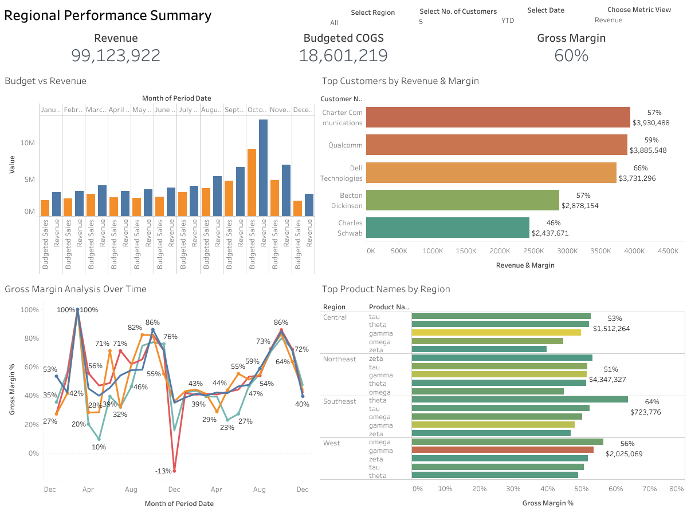

# Widget Sales and Margin Analysis

## Project Overview
This project analyzes the revenue, gross margin, and regional performance of a global widget manufacturer whose products are used widely across Fortune 500 companies. The client sells roughly ten widget varieties through sales teams operating in four geographic regions. Due to years of neglected data processes and controls, the organization lacked clear visibility into customer profitability, product performance, and margin trends.

Using Tableau, I developed an interactive performance dashboard to evaluate revenue trends, budget variance, customer profitability, and regional margin behavior. The goal of the analysis is to surface high-value opportunities, highlight margin risks, and support more informed commercial and operational decisions.

---

## Key Insights
- **Revenue Strength:** YTD revenue reached approximately **51M**, with most months outperforming planned budgets.
- **Margin Expansion:** Gross margin improved significantly from **40% to 80%**, indicating better pricing discipline and cost efficiency.
- **Top Customer Profitability:** Several enterprise clients delivered margins near **100%**, making them strong candidates for strategic expansion.
- **Regional Variation:** The **Northeast region** generated the highest revenue but held only **51% margin**, suggesting cost pressure or discounting impacts.
- **Product Mix Impact:** Higher-margin widget varieties drove peak profitability, creating opportunities to steer sales focus toward more profitable products.

---

## What This Analysis Enables
- Clear visibility into the drivers of revenue and margin performance  
- Better identification of high-value customers and weak-margin regions  
- More informed pricing, discounting, and product mix strategies  
- Stronger forecasting and budget alignment  
- Data-driven guidance for commercial and operational planning  

---

## Dashboard Features
- Interactive filters for region, customer count, date range, and metric type  
- Revenue vs. budget comparison visual  
- Customer-level revenue and margin rankings  
- Month-over-month gross margin trend analysis  
- Product performance comparison across regions  

---

## Tools Used
- **Tableau** for visualization and dashboard development  
- **SQL / Excel** for data review and exploration  
- **Data Warehousing Concepts** for understanding revenue, COGS, and margin behavior  

---

## How to Use
1. Open the Tableau workbook or dashboard export.  
2. Use the filters to explore revenue, margin, customer, and regional insights.  
3. Review insights to support strategic decisions across sales, pricing, and product planning.  

---

## Future Enhancements
- Add forecasting models to project expected sales and margin performance  
- Expand customer segmentation for deeper profitability analysis  
- Integrate more granular cost data to improve COGS accuracy  
